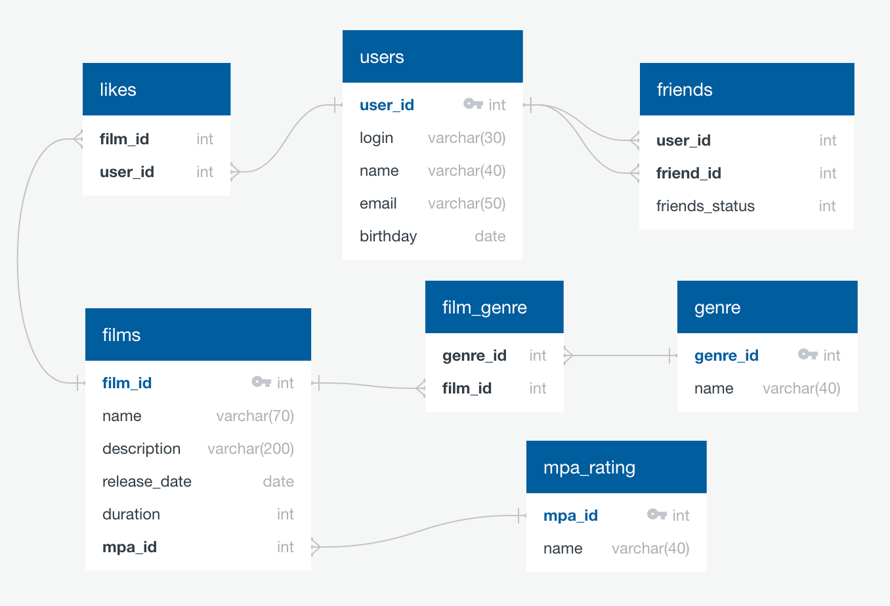

# Приложение "Filmorate"
<picture>
    
</picture>
Данное приложение обрабатывает данные фильмов:clapper: и пользователей:office_worker:,
которые ставят оценки этим фильмам. Имеет следующую функциональность:

* хранение списка фильмов
* выгрузка списков фильмов по рейтингу и популярности
* возможность ставить лайки
* вывод рекомендаций к просмотру

### Структура БД проекта :movie_camera:
<picture>
    
</picture>

# Примеры запросов

**Получение списка всех пользователей:**

```sql
SELECT *
FROM users;
```

| user\_id | email            | login   | name      | birthday   |
|:--------:|:-----------------|:--------|:----------|:-----------|
|    1     | vas-qzy@mail.ru  | Vaso666 | Василий   | 1998-11-15 |
|    2     | alexxx77@ro.ru   | ALLeonov| Александр | 2003-03-24 |
|    3     | paalax@yandex.ru | Nathan  | Валентин  | 1978-01-23 |

**Другие запросы:**
```sql
-- Получение списка всех фильмов:  
SELECT * 
FROM films;  

-- Получение списка 10 популярных фильмов:  
SELECT fi.*
FROM films AS fi   
LEFT JOIN likes AS li ON fi.film_id = li.film_id  
GROUP BY fi.film_id  
ORDER BY COUNT(li.user_id) desc  
limit 10;

-- Получение списка друзей пользователя:
SELECT us.user_id,
       us.name, 
       us.login,
FROM friends AS fr
LEFT JOIN users AS us ON fr.friend_id = us.user_id 
WHERE fr.user_id = (искомый пользователь)  
ORDER BY us.user_id;
```
Стек технологий:
Java 11, Spring Boot, Maven, REST API, H2